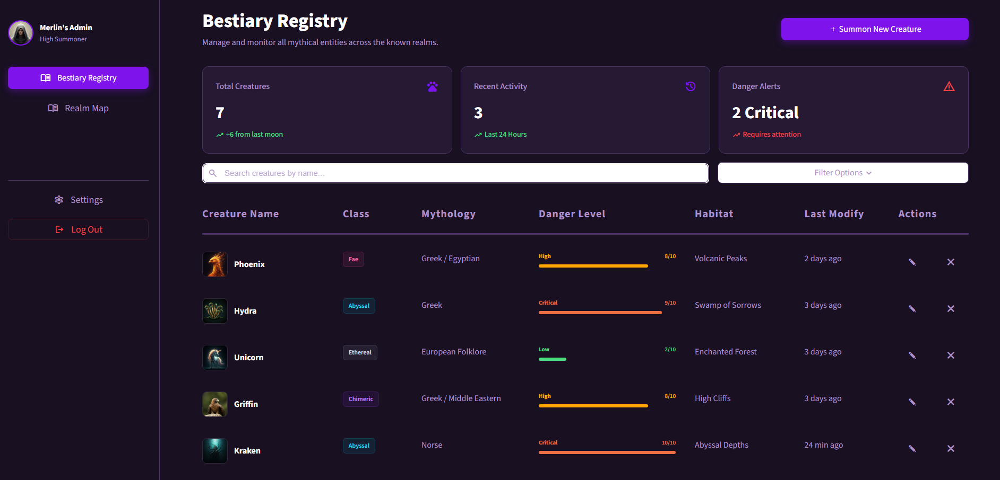
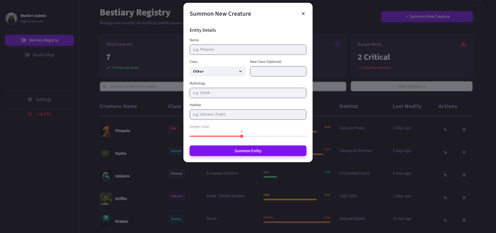
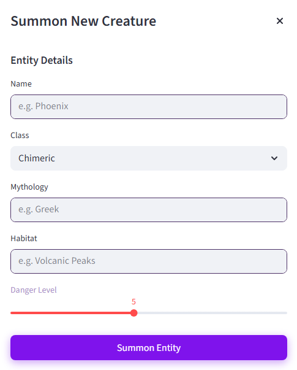
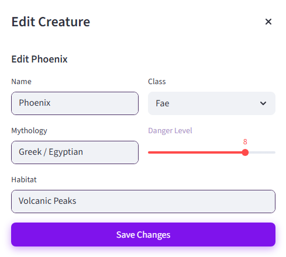
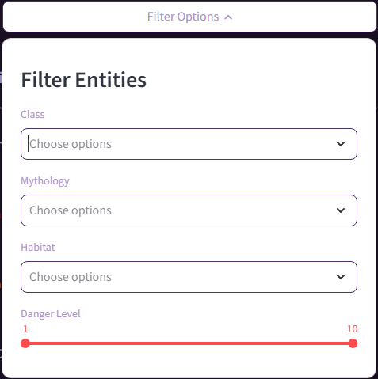
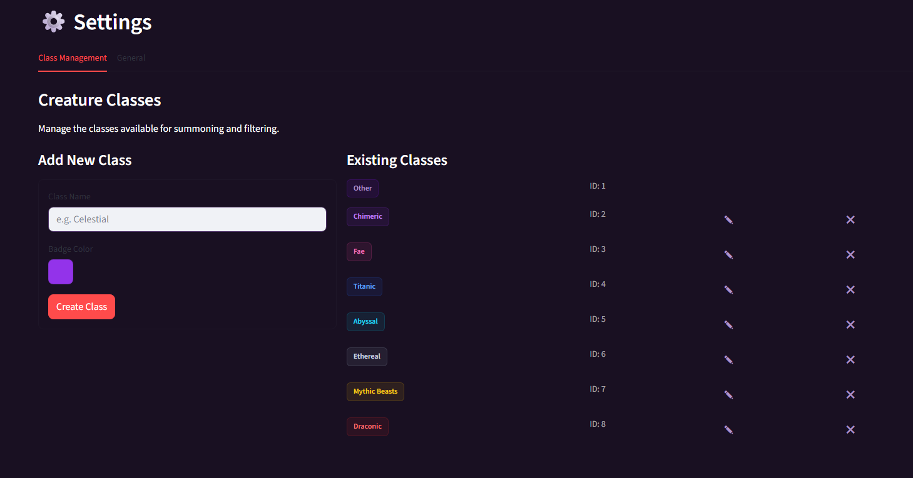

# 🐉 Bestiary Registry - Mythical Creature Management System


This project implements **EX1 (FastAPI Backend)** and **EX2 (Streamlit Frontend)**. It is a registry for managing a "Bestiary" of mythical creatures, allowing users to catalogue and view entities across different mythologies.

## Important Links
*   **Backend (Render)**: [https://bestiary-registry.onrender.com](https://bestiary-registry.onrender.com)
*   **Frontend (Streamlit)**: [https://bestiary-registry.streamlit.app](https://bestiary-registry.streamlit.app)
*   **API Documentation**: [https://bestiary-registry.onrender.com/docs](https://bestiary-registry.onrender.com/docs)

## Backend - What Exists
*   **FastAPI** backend with full CRUD support for creatures and classes.
*   **SQLite** used for persistence.
*   Returns standard JSON responses with appropriate HTTP status codes (e.g., 404 for missing resources).

## Frontend - What the User Can Do
*   Implemented using **Streamlit**.
*   View existing registry data fetched from the backend.
*   Supports full CRUD workflows for creatures and classes via the frontend.

It features persistent data management, dynamic real-time filtering, automated avatar generation, and a responsive dark-mode UI.

---

## Application Showcase

### 1. The Dashboard
The central command center for monitoring all registered entities. Features real-time metrics, a responsive data grid, and quick actions. 

<p align="center">

</p>

### 2. Summoning New Entities
A streamlined workflow for adding new creatures to the registry.
*   **Step 1: Initiation** - Launching the summon dialog.
    
<p align="center">
  
</p>

*   **Step 2: Details** - Filling in creature attributes (Class, Mythology, Danger Level).

<p align="center">
  
</p>

*   **Step 3: Creation** - Pressing the 'Summon Entity' button creates a new creature and adds it into the registry.


### 3. Entity Management (Editing)
Modify existing records with ease, updating attributes like Danger Level, Habitat, or Class as the lore evolves.

<p align="center">
  
</p>

### 4. Advanced Filtering
Drill down into the data using powerful multi-select filters for Class, Mythology, and Danger Level ranges.

<p align="center">
  
</p>

### 5. System Settings
Manage global configurations, including the creation and customization of Creature Classes/Categories.

<p align="center">
  
</p>

---

## Key Features

*   **FastAPI Backend**: Backend implemented using **FastAPI** with auto-generated Swagger/OpenAPI documentation.
*   **Persistent Storage**: Uses **SQLite** with **SQLModel** (ORM) for local data persistence.
*   **Streamlit Frontend**: Streamlit-based frontend with custom CSS styling and interactive UI components.
*   **Real-Time Exploration**:
    *   **Instant Search**: Filter by name as you type.
    *   **Multi-Faceted Filtering**: Filter by multiple categories simultaneously.
*   **Realm Map**: Visual territory mapping.
*   **Avatars**: Uses DiceBear identicon API. Images are external URLs.
*   **Testing**: API tests implemented using pytest and FastAPI TestClient.

---

## Technology Stack

| Component | Technologies |
| :--- | :--- |
| **Backend** | Python 3.11+, FastAPI, Uvicorn, SQLModel (Pydantic + SQLAlchemy) |
| **Frontend** | Streamlit, Requests, Custom CSS, `streamlit-keyup` |
| **Database** | SQLite (Local file: `creatures.db`) |
| **Tooling** | `uv` (Package Management), Pytest, Ruff (Linting) |

---

## 📂 Project Structure

```text
EX1_FastAPI_Foundations/
├── backend/
│   ├── app/
│   │   ├── routers/       # API Route modules (creatures, classes)
│   │   ├── services/      # Business logic layer
│   │   ├── models.py      # Database schemas & Pydantic models
│   │   └── db.py          # Database connection & session management
│   ├── tests/             # Backend automated tests
│   ├── main.py            # Application entry point
│   └── pyproject.toml     # Backend dependencies
├── frontend/
│   ├── tests/             # Frontend automated tests
│   ├── pictures/          # Static assets
│   ├── dashboard.py       # Main Application Entry Point
│   ├── sidebar.py         # Navigation component
│   ├── settings.py        # Settings & Configuration page
│   ├── realm_map.py       # Map visualization module
│   └── style.css          # Global visual styling/theming
└── README.md
```

---

## Quick Start Guide

### Prerequisites
*   Python 3.11 or higher
*   `uv` package manager (recommended) or `pip`

### 1. Backend Setup
Initialize the backend environment and start the API server.

```powershell
cd backend
uv sync               # Install dependencies
uv run python main.py # Start server at http://localhost:8000
```

### 2. Frontend Setup
Launch the dashboard interface. (Open a new terminal window).

```powershell
# Ensure you are in the project root
cd backend 
uv run python -m streamlit run ../frontend/dashboard.py
```
*The dashboard will auto-launch at `http://localhost:8501`*

---

## Docker (Alternative Run Method)
The backend is dockerized. A `Dockerfile` exists and builds successfully.

If you prefer running via Docker (backend only):
```powershell
# Run from 'backend' directory
docker build -t bestiary-backend .
docker run -d -p 8000:8000 bestiary-backend
```

---

## API Documentation

Once the backend is running, full interactive documentation is available:
*   **Swagger UI**: [http://localhost:8000/docs](http://localhost:8000/docs)
*   **ReDoc**: [http://localhost:8000/redoc](http://localhost:8000/redoc)

## Testing
Includes automated API tests using `pytest` and `FastAPI TestClient`, verified to run successfully from the backend environment.

Run the full verified test suite:
```powershell
uv run python -m pytest tests/ ../frontend/tests/
# (Run from 'backend' directory)
```
*Tests pass successfully.*

## Code Quality
Uses `ruff` for code formatting and linting.

```powershell
uv run ruff check .
uv run ruff format --check .
```

## 📝 Note
This project serves as a foundation for further course work.